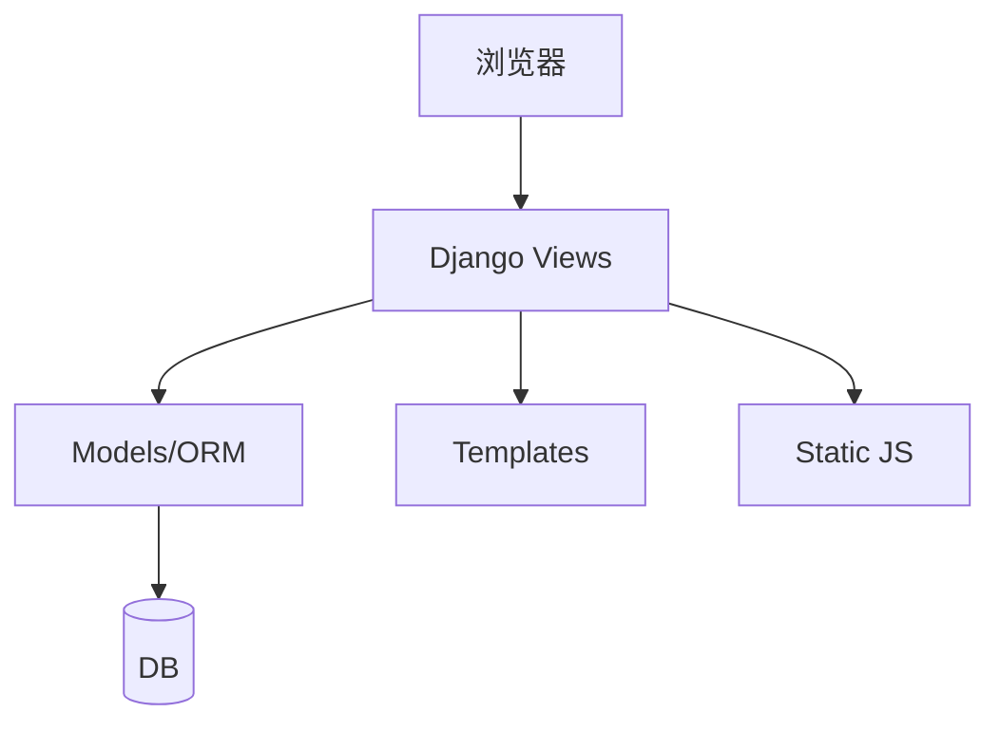

# 2FA 在线工具（ToTP Management System）

一个基于 Django 的企业级 TOTP（Time-based One-Time Password）密钥管理平台，面向个人与团队场景，提供安全存储、协作共享与审计追踪能力。

## 目录

- [1. 产品概述](#1-产品概述)
- [2. 核心功能特性](#2-核心功能特性)
- [3. 系统架构](#3-系统架构)
- [4. 目录结构](#4-目录结构)
- [5. 快速开始（本地运行）](#5-快速开始本地运行)
- [6. 用户操作指南](#6-用户操作指南)
- [7. 配置说明](#7-配置说明)
- [8. 部署指南（生产）](#8-部署指南生产)
- [9. 升级指南](#9-升级指南)
- [10. 常见问题 FAQ](#10-常见问题-faq)
- [11. 故障排除](#11-故障排除)
- [12. 截图说明](#12-截图说明)

---

## 1. 产品概述

本项目旨在解决团队协作中共享 2FA 密钥的痛点，提供安全、便捷的密钥存储、共享和审计能力。

核心价值：
- 集中管理：统一存储个人与团队 2FA 密钥。
- 安全共享：通过团队空间共享密钥，避免明文在 IM/邮件里流转。
- 审计追踪：记录关键操作，便于追责与合规。
- 便携访问：响应式 UI，适配移动端。

---

## 2. 核心功能特性

### 2.1 密钥管理

- 添加密钥：支持 Base32、`otpauth://` URI、二维码图片识别。
- 分组管理：个人空间支持分组；团队空间按权限管理。
- 验证码生成：实时生成验证码，支持点击复制与自动刷新。
- 回收站：删除条目进入回收站，避免误删（清理逻辑按项目实现）。

### 2.2 团队协作

- 团队空间：隔离不同团队的密钥与审计。
- 成员角色：拥有者/管理员/成员，按角色决定管理权限。

### 2.3 数据安全

- 加密存储：TOTP 密钥在数据库中加密存储。
- 二次验证（Re-auth）：导出等敏感操作要求近期二次确认。
- 审计日志：记录创建、删除、导出、一次性链接等行为。
- 一次性链接：用于临时协作的限次/限时访问链接。

### 2.4 导入与导出

- 批量导入：支持常见导出格式，提供预览、重复项提示。
- 加密导出：导出前可设置口令对导出包加密。
- 离线包：生成单 HTML 文件，在无网络环境查看验证码。

### 2.5 快速工具

- 免登录工具：用于临时生成验证码（请勿在不可信设备输入长期密钥）。

---

## 3. 系统架构

### 3.1 技术栈

- 后端：Python + Django
- 前端：Bootstrap 5 + 原生 JavaScript
- 数据库：开发默认 SQLite；生产推荐 PostgreSQL
- 缓存：可选 Redis（用于缓存/限流等）

### 3.2 模块划分

- 账户与认证：`accounts/`
- 核心业务：`totp/`
- 项目配置：`project/`
- 模板与静态资源：`templates/`、`static/`

### 3.3 数据流（示意）



---

## 4. 目录结构

```text
ToTP/
  accounts/              # 账号系统（登录/注册/二次确认等）
  project/               # Django 项目配置（settings/urls/wsgi 等）
  static/                # 开发态静态资源（JS/CSS）
  staticfiles/           # collectstatic 产物（部署/镜像构建时生成）
  templates/             # Django 模板
  totp/                  # 核心业务（模型、视图、导入导出、API、测试）
  arch.md                # 架构补充文档
  manage.py
  requirements.txt
```

---

## 5. 快速开始（本地运行）

```bash
python -m venv .venv
source .venv/bin/activate
pip install -r requirements.txt
python manage.py migrate
python manage.py runserver
```

浏览器访问：
- 仪表盘：`http://127.0.0.1:8000/`
- 登录页：`/auth/login/`

---

## 6. 用户操作指南

### 6.1 注册与登录

1. 首页右上角点击“注册/登录”。
2. 如启用 Google One Tap，可使用快捷登录。

### 6.2 添加密钥

1. 进入“我的密钥/团队空间”。
2. 点击“添加密钥”。
3. 输入名称，粘贴 Base32 或 `otpauth://`，或上传二维码图片。
4. 点击“保存”。

### 6.3 批量导入

1. 点击“批量导入”。
2. 选择目标空间（个人/团队）。
3. 粘贴文本或上传文件。
4. 先预览，确认后导入。

### 6.4 导出

- 加密导出（推荐）：输入口令生成加密包。
- 离线包：生成 HTML 离线文件。
- 执行导出通常需要二次确认（Re-auth）。

### 6.5 团队管理

1. 导航栏进入“团队空间”。
2. 创建团队、邀请成员、分配角色。

---

## 7. 配置说明

项目通过环境变量配置，核心配置位于 [settings.py](file:///Users/lingchong/Downloads/wwwroot/ToTP/project/settings.py)。

### 7.1 必需配置（生产）

| 变量名 | 描述 |
| --- | --- |
| `DJANGO_SECRET_KEY` | Django `SECRET_KEY`（强随机，务必保密） |
| `DJANGO_DEBUG` | 调试模式（生产必须为 `False`） |
| `DJANGO_ALLOWED_HOSTS` | 允许访问的 Host 列表（逗号分隔，生产禁止 `*`） |
| `TOTP_ENC_KEY` 或 `TOTP_ENC_KEYS` | TOTP 密钥加密密钥（建议支持轮换） |

### 7.2 可选配置（常用）

| 变量名 | 描述 | 默认值 |
| --- | --- | --- |
| `REDIS_URL` | 缓存/限流/会话等使用的 Redis 地址 | 空（回退本地内存缓存） |
| `GOOGLE_CLIENT_ID` | Google One Tap 客户端 ID | 示例占位值 |
| `DJANGO_SECURE_SSL_REDIRECT` | 强制 HTTPS | 生产默认启用 |
| `DJANGO_SESSION_COOKIE_SECURE` | Secure Session Cookie | 生产默认启用 |
| `DJANGO_CSRF_COOKIE_SECURE` | Secure CSRF Cookie | 生产默认启用 |
| `DJANGO_HSTS_SECONDS` | HSTS 秒数 | 生产默认 31536000 |
| `DJANGO_TRUST_X_FORWARDED_FOR` | 是否信任 `X-Forwarded-For` | `False` |
| `TOTP_EXPORT_ENCRYPTED_MAX_ENTRIES` | 加密导出单次最大条目数 | `2000` |
| `TOTP_EXPORT_OFFLINE_MAX_ENTRIES` | 离线包单次最大条目数 | `1000` |

---

## 8. 部署指南（生产）

### 8.1 环境要求

- 操作系统：Ubuntu 20.04+ / Debian 11+ / CentOS 10+
- Python：3.10+
- 数据库：PostgreSQL 13+（推荐）
- Web：Nginx
- 应用：Gunicorn
- 缓存：Redis（可选）

### 8.2 安装依赖

```bash
sudo apt update
sudo apt install python3-pip python3-venv python3-dev libpq-dev postgresql nginx git
```

### 8.3 获取代码与安装依赖

```bash
cd /var/www
git clone https://github.com/your-repo/ToTP.git totp
cd totp

python3 -m venv venv
source venv/bin/activate
pip install -r requirements.txt
pip install gunicorn psycopg2-binary
```

### 8.4 配置环境变量

建议通过 systemd `Environment=` 或 `.env` 注入环境变量。最低要求：

- `DJANGO_SECRET_KEY`
- `DJANGO_DEBUG=False`
- `DJANGO_ALLOWED_HOSTS`
- `TOTP_ENC_KEY` 或 `TOTP_ENC_KEYS`

生成 `TOTP_ENC_KEY` 示例：

```python
from cryptography.fernet import Fernet
print(Fernet.generate_key().decode())
```

### 8.5 数据库初始化

```bash
source venv/bin/activate
python manage.py migrate
python manage.py createsuperuser
```

### 8.6 静态文件

```bash
python manage.py collectstatic --noinput
```

### 8.7 Gunicorn + systemd

创建 `/etc/systemd/system/totp.service`：

```ini
[Unit]
Description=gunicorn daemon for ToTP
After=network.target

[Service]
User=www-data
Group=www-data
WorkingDirectory=/var/www/totp
ExecStart=/var/www/totp/venv/bin/gunicorn \
          --access-logfile - \
          --workers 3 \
          --bind unix:/run/totp.sock \
          project.wsgi:application
Environment="DJANGO_SECRET_KEY=your-secret-key"
Environment="DJANGO_DEBUG=False"
Environment="TOTP_ENC_KEY=your-enc-key"

[Install]
WantedBy=multi-user.target
```

```bash
sudo systemctl start totp
sudo systemctl enable totp
```

### 8.8 Nginx 反向代理

创建 `/etc/nginx/sites-available/totp`：

```nginx
server {
    listen 80;
    server_name 2fa.example.com;

    location = /favicon.ico { access_log off; log_not_found off; }

    location /static/ {
        root /var/www/totp;
    }

    location / {
        include proxy_params;
        proxy_pass http://unix:/run/totp.sock;
    }
}
```

```bash
sudo ln -s /etc/nginx/sites-available/totp /etc/nginx/sites-enabled
sudo nginx -t
sudo systemctl restart nginx
```

建议启用 HTTPS（Certbot）：

```bash
sudo apt install certbot python3-certbot-nginx
sudo certbot --nginx -d 2fa.example.com
```

### 8.9 验证测试与安全检查

```bash
python manage.py test
python manage.py check --deploy
```

### 8.10 监控与维护

- Gunicorn 日志：`journalctl -u totp -f`
- Nginx 日志：`/var/log/nginx/access.log`、`/var/log/nginx/error.log`
- 建议定期备份数据库与配置（见升级文档的备份策略）

---

## 9. 升级指南

### 9.1 升级前检查清单

- 确认当前版本与目标版本
- 阅读变更记录（如存在 `CHANGELOG.md`）
- 确认磁盘空间与维护窗口

### 9.2 备份策略（强制）

PostgreSQL 备份：

```bash
pg_dump -U postgres totp > totp_backup_$(date +%Y%m%d).sql
```

配置备份：

```bash
cp .env .env.backup_$(date +%Y%m%d)
cp db.sqlite3 db.sqlite3.backup_$(date +%Y%m%d)  # 如仍在使用 SQLite
```

### 9.3 分步骤升级流程

```bash
cd /var/www/totp
git fetch origin
git checkout main
git pull origin main

source venv/bin/activate
pip install -r requirements.txt
python manage.py migrate
python manage.py collectstatic --noinput
sudo systemctl restart totp
```

### 9.4 升级后验证

1. 登录是否正常
2. 列表页是否刷新验证码、无 JS 报错
3. 添加/导入/导出是否可用
4. 静态资源是否有 404（尤其开启 manifest 时）

### 9.5 回滚方案

代码回滚：

```bash
git checkout <上一版本commit_id>
sudo systemctl restart totp
```

数据库回滚（PostgreSQL）：

```bash
dropdb -U postgres totp
createdb -U postgres totp
psql -U postgres totp < totp_backup_YYYYMMDD.sql
```

重要注意事项：
- 升级过程中不要更改 `TOTP_ENC_KEY` / `TOTP_ENC_KEYS`，否则旧数据无法解密。

---

## 10. 常见问题 FAQ

**Q: 密钥安全吗？**
- 数据库存储为加密形式；生产环境务必配置强随机 `DJANGO_SECRET_KEY` 与 `TOTP_ENC_KEY(S)` 并妥善保管。

**Q: 验证码不正确？**
- 首先检查服务器时间是否准确（NTP），TOTP 强依赖时间同步。

**Q: 为什么导出需要二次确认？**
- 为降低会话劫持风险，敏感操作要求近期重新认证。

---

## 11. 故障排除

- 验证码不正确：检查服务器时间同步、浏览器/系统时间是否异常。
- 无法发送邮件：检查 SMTP 配置是否正确（若启用）。
- 导入失败：确认导入格式是否符合 `otpauth://` 或受支持的 CSV/JSON 格式。

---

## 12. 截图说明

由于 README 在代码仓库内通常不直接存放截图文件，本节给出推荐截图清单与说明文字模板（用于你后续补充到 `docs/images/` 或 Wiki）。

建议至少包含以下截图（每张配 1~2 句说明）：

1. 我的密钥列表页（验证码自动刷新、点击复制、空态 CTA）
2. 添加密钥弹窗（支持 Base32/otpauth/二维码导入）
3. 批量导入弹窗（导入方式选择、预览结果、重复项提示）
4. 团队空间（成员角色与权限展示）
5. 审计页（关键操作记录、导出审计）
6. 加密导出弹窗与离线包生成提示

