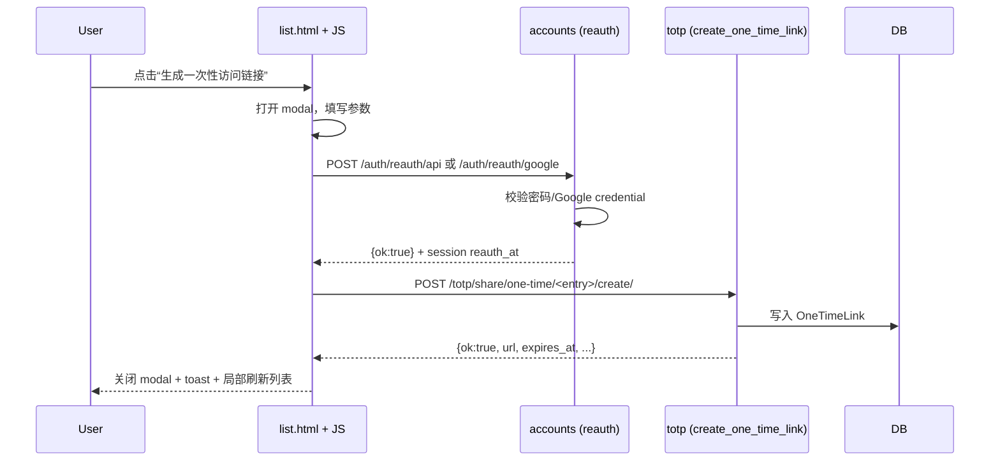
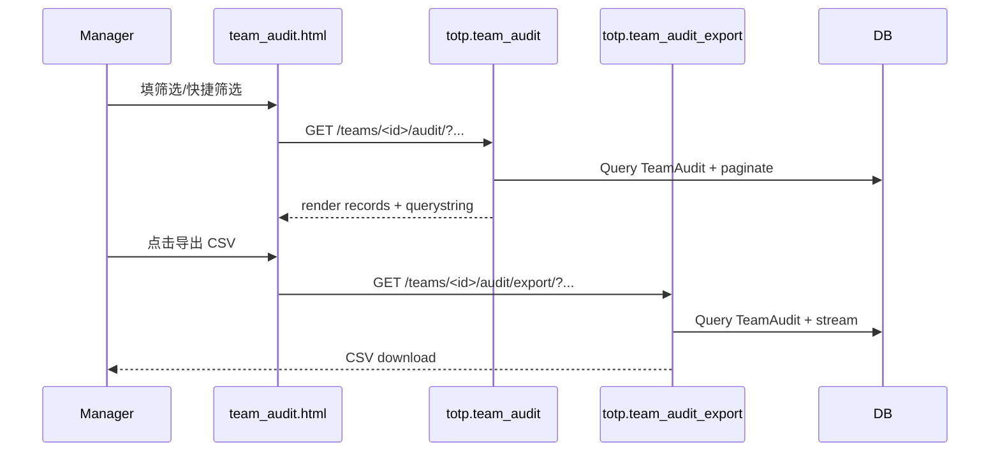

# 功能模块清单与架构文档

## 目录

- [1. 总体架构](#1-总体架构)
- [2. 模块清单（按业务域/层级聚类）](#2-模块清单按业务域层级聚类)
- [3. 关键业务流程（时序图）](#3-关键业务流程时序图)
- [4. 配置项总表](#4-配置项总表)
- [5. 测试覆盖概览](#5-测试覆盖概览)

## 1. 总体架构

该项目为 Django 单体应用（SSR + 少量原生 JS 增强交互），按业务域拆分为：

- `accounts/`：账户与认证（含 Google One Tap、reauth）
- `totp/`：核心业务（密钥、团队、资产、一次性链接、审计、导入导出、外部工具）
- `project/`：项目级配置/路由/中间件
- `templates/` + `static/`：表现层

### 1.1 架构图（Mermaid）

```mermaid
flowchart TB
  Browser[浏览器] -->|HTTP| Django[Django App]
  Django --> Templates[templates/ (SSR)]
  Django --> Static[static/ (JS/CSS)]

  Django --> Accounts[accounts/]
  Django --> TOTP[totp/]
  Django --> Project[project/]

  Accounts -->|reauth_at session| TOTP
  Project -->|CSP nonce / headers| Templates

  TOTP --> DB[(Database)]
  Accounts --> DB
```

### 1.2 调用层级（简化）

- 表现层：`templates/*`、`static/js/*`
- 入口路由：`project/urls.py` → `totp/urls.py` / `accounts/urls.py`
- 业务控制器：`totp/views.py`、`accounts/views.py`
- 领域模型：`totp/models.py`
- 领域工具：`totp/utils.py`、`totp/importers.py`、`totp/querysets.py`

## 2. 模块清单（按业务域/层级聚类）

### 2.1 Project（项目层）

- **职责**
  - Django 全局配置、根路由入口、CSP Nonce 中间件与上下文注入、通用工具。
- **对外接口**
  - 根路由挂载：`/`（dashboard）、`/totp/*`、`/auth/*`（见 `project/urls.py`）。
  - CSP Nonce：模板变量 `csp_nonce`；响应头 `Content-Security-Policy`（按 settings 开关）。
- **核心文件/函数**
  - `project/settings.py`：环境变量读取、缓存/静态/CSP/安全 cookie 等配置。
  - `project/middleware.py`：`CSPNonceMiddleware`
  - `project/context_processors.py`：`csp_nonce`
  - `project/utils.py`：`client_ip`
- **依赖关系**
  - 依赖 Django；可选依赖 Redis（cache）。
- **配置项**
  - `DJANGO_SECRET_KEY`、`DJANGO_DEBUG`、`DJANGO_ALLOWED_HOSTS`、`TRUST_X_FORWARDED_FOR`
  - `REDIS_URL`
  - `DJANGO_CSP`、`DJANGO_CSP_REPORT_ONLY`
  - `DJANGO_SECURE_SSL_REDIRECT`、`DJANGO_SECURE_HSTS_SECONDS` 等
- **测试覆盖**
  - 通过全量 test suite 覆盖到 `client_ip`（间接用于登录/注册限流），CSP 目前为集成配置项，未见专门单测。

### 2.2 Accounts（账户域）

- **职责**
  - 登录/注册/登出、二次确认（reauth 页面与 JSON API）、Google One Tap、个人资料与密码设置/修改。
- **对外接口（URLs）**
  - `/auth/login/`、`/auth/signup/`、`/auth/logout/`
  - `/auth/reauth/`（页面）、`/auth/reauth/api`（JSON）、`/auth/reauth/google`
  - `/auth/profile/`
  - `/auth/google/onetap`
- **核心类/函数**
  - 视图：`login_view`、`signup_view`、`reauth_view`、`reauth_api`、`reauth_google`、`profile_view`、`google_onetap`
  - 表单：`ProfileForm`、`PasswordUpdateForm`、`PasswordSetForm`、`password_strength_errors`
  - 限流：`_rate_limit_allow`
- **依赖关系**
  - `google-auth`（Google One Tap token 校验）
  - 使用 `project.utils.client_ip` 做基于 IP 的限流 key
  - 依赖 `totp.models`（profile 页安全提示汇总）
- **配置项**
  - `GOOGLE_CLIENT_ID`
  - 登录/注册限流常量（代码内常量，可考虑配置化）
- **测试覆盖**
  - `accounts/tests/`：One Tap、reauth_api、reauth_google、profile、管理命令覆盖。

### 2.3 TOTP 核心（密钥与分组）

- **职责**
  - 个人/团队密钥条目管理、分组、回收站、列表页渲染与 tokens API。
- **对外接口**
  - `/totp/list/`（密钥列表）
  - `/totp/api/tokens/`（返回当前周期 token）
  - 条目 CRUD 与分组：`/totp/add/`、`/totp/rename/<id>/`、`/totp/delete/<id>/`、`/totp/group/*`、`/totp/update-*`
  - 回收站：`/totp/trash/`、`/totp/restore/<id>/` 等
- **核心类/函数**
  - 模型：`TOTPEntry`、`Group`、`TOTPEntryAudit`
  - 视图：`list_view`、`add_entry`、`rename_entry`、`delete_entry`、`trash_view`、`restore_entry`
  - API：`totp/api.py::api_tokens`
  - 查询构造：`totp/querysets.py::entries_queryset_for_list`
- **依赖关系**
  - `totp/utils.py`（加密与 TOTP 计算）
  - 审计写入：`log_entry_audit`
- **配置项**
  - `TOTP_ENC_KEYS`（建议生产必须配置）
- **测试覆盖**
  - `totp/tests/test_api_tokens.py`、`test_group_management.py`、`test_recycle_bin.py`、`test_query_counts.py` 等。

### 2.4 团队（Team/成员/邀请/治理）

- **职责**
  - 团队空间、成员与角色、邀请流、团队工作台（team_home）、治理面板（actions panel）、团队审计（TeamAudit）。
- **对外接口**
  - `/totp/teams/`（团队列表）
  - `/totp/teams/<id>/home/`（团队工作台）
  - `/totp/teams/<id>/audit/`（团队审计） + `/export/`
  - `/totp/teams/<id>/tab/<name>/`（tab fragment）
  - `/totp/teams/<id>/panel/`（actions panel fragment）
- **核心类/函数**
  - 模型：`Team`、`TeamMembership`、`TeamInvitation`、`TeamAudit`
  - 视图：`teams_overview`、`team_home`、`team_actions_panel`、`team_tab_fragment`、`team_audit`、`team_audit_export`
- **依赖关系**
  - RBAC：`_get_team_membership(require_manage=...)`（在 views 中统一校验）
- **配置项**
  - 无独立 settings；更多为代码常量与权限规则。
- **测试覆盖**
  - `totp/tests/test_team_*`（teams page、home、tab fragments、audit/export、invitation、rename 等）。

### 2.5 团队资产（TeamAsset）

- **职责**
  - 资产目录与归档（将团队密钥归属到资产，明确责任与治理）。
- **对外接口**
  - `/totp/teams/<id>/assets/` 与 asset CRUD / options（用于导入/选择）
- **核心类/函数**
  - 模型：`TeamAsset`
  - 视图：`team_assets`、`team_asset_*` 系列
- **测试覆盖**
  - `totp/tests/test_team_assets.py`

### 2.6 一次性访问链接（OneTimeLink）

- **职责**
  - 生成一次性只读访问链接、访问扣减与失效、个人/团队审计列表、批量失效/团队提醒。
- **对外接口**
  - 创建/失效：`/totp/share/one-time/<entry_id>/create/`、`/totp/share/one-time/<id>/invalidate/`
  - 访问页：`/totp/link/<token>/`
  - 审计页：`/totp/share/one-time/audit/`、`/totp/teams/<id>/share/one-time/audit/`
  - 批量：`/totp/share/one-time/batch/invalidate/`、团队 batch invalidate/remind
- **核心类/函数**
  - 模型：`OneTimeLink`
  - 视图：`create_one_time_link`、`invalidate_one_time_link`、`one_time_view`
  - 审计：`one_time_link_audit`、`one_time_link_team_audit` + export
  - 批量：`batch_invalidate_one_time_links(_team)`、`batch_remind_one_time_links_team`
- **依赖关系**
  - 依赖 reauth：`_has_recent_reauth`、`accounts` 域 reauth_* 接口
- **测试覆盖**
  - `totp/tests/test_one_time_link.py`、`test_one_time_audit_batch.py`、`test_team_one_time_admin_audit.py`、`test_team_share_links.py`

### 2.7 导入导出

- **职责**
  - 批量导入、导出明文/加密/离线包、下载确认页。
- **对外接口**
  - `/totp/import/preview/`、`/totp/import/apply/`
  - `/totp/export/`、`/totp/export/encrypted/`、`/totp/export/offline/`、`/totp/export/download/`
- **核心类/函数**
  - 导入：`totp/importers.py`
  - 导出：`totp/views.py` export_* 系列
- **依赖关系**
  - 依赖 reauth 与加解密（离线包/加密导出）
- **测试覆盖**
  - `totp/tests/test_export_*`、`test_batch_import.py`、`test_export_limits.py`

### 2.8 外部工具（External TOTP Tool）

- **职责**
  - 对外提供一个“外部工具页/接口”用于计算 TOTP（受配置与限流影响）。
- **对外接口**
  - `/totp/external/tool/`、`/totp/external/otp/`
- **测试覆盖**
  - `totp/tests/test_external_totp.py`

## 3. 关键业务流程（时序图）

### 3.1 生成一次性访问链接（含二次确认）



### 3.2 团队审计（筛选 → 导出）



## 4. 配置项总表

仅列出会影响运行/安全/主要能力的关键项（详见 `project/settings.py`）：

| 配置项 | 作用 | 建议 |
|---|---|---|
| `DJANGO_SECRET_KEY` | Django 密钥 | 生产必须强随机且保密 |
| `DJANGO_DEBUG` | Debug 模式 | 生产必须 false |
| `DJANGO_ALLOWED_HOSTS` | Host 白名单 | 生产必须显式配置 |
| `TOTP_ENC_KEYS` | TOTP 条目加密密钥列表 | 生产必须配置且支持轮换 |
| `REDIS_URL` | 缓存/限流后端 | 生产建议配置 |
| `DJANGO_CSP`/`DJANGO_CSP_REPORT_ONLY` | CSP 开关 | 生产建议启用 |
| `TRUST_X_FORWARDED_FOR` | 是否信任 XFF | 仅在受控反代后启用 |
| `GOOGLE_CLIENT_ID` | One Tap 客户端 ID | 使用 One Tap 时必配 |

## 5. 测试覆盖概览

- `accounts/tests/`：登录/注册/reauth/OneTap/命令等。
- `totp/tests/`：覆盖核心业务（导入导出、审计、团队/资产、一次性链接、回收站、可访问性与安全加固）。

建议后续补齐：

- 前端交互层面的 e2e（当前 repo 未集成 Playwright/Selenium）。
